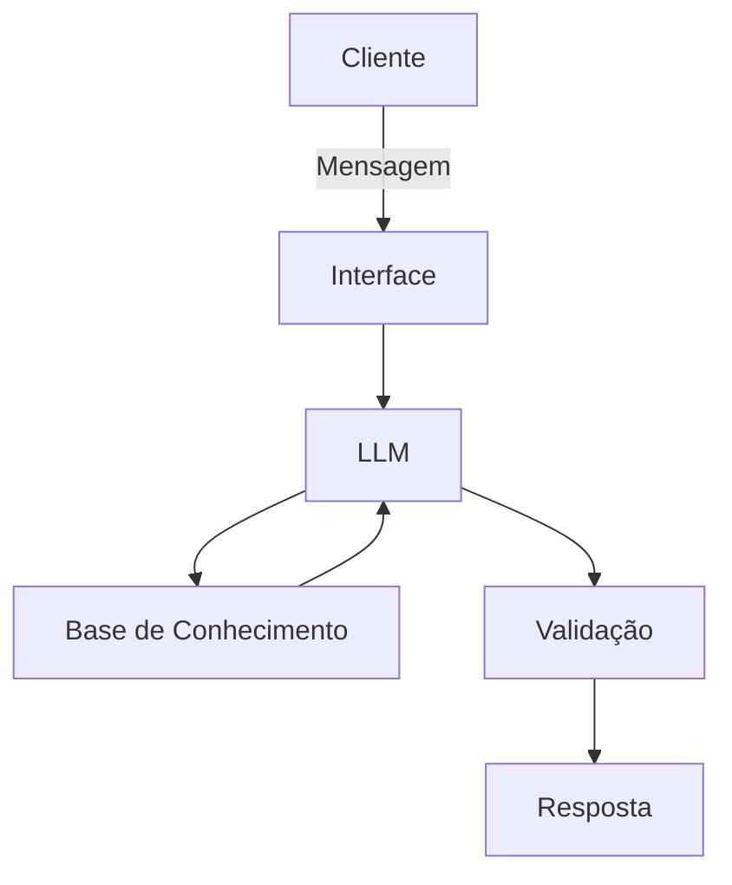

# Documentação do Agente

## Caso de Uso

### Problema
> Qual problema financeiro seu agente resolve?

A dificuldade de brasileiros em controlar gastos variáveis e a falta de percepção sobre para onde o dinheiro "foge" no dia a dia, gerando ansiedade financeira.

### Solução
> Como o agente resolve esse problema de forma proativa?

O agente monitora transações em tempo real (via integração ou upload), categoriza gastos automaticamente e emite alertas proativos quando o usuário se aproxima do limite de uma categoria (ex: "Você já gastou 80% do seu orçamento de iFood este mês").

### Público-Alvo
> Quem vai usar esse agente?

Jovens profissionais e estudantes que buscam autonomia financeira, mas não têm paciência para preencher planilhas manuais.

---

## Persona e Tom de Voz

### Nome do Agente
Fin (Guia Financeiro)

### Personalidade
> Como o agente se comporta? (ex: consultivo, direto, educativo)

Consultivo e encorajador. Ele não julga os gastos, mas atua como um parceiro que traz clareza para a tomada de decisão.

### Tom de Comunicação
> Formal, informal, técnico, acessível?

Acessível e direto. Evita "economês" excessivo, traduzindo termos técnicos para uma linguagem cotidiana.

### Exemplos de Linguagem
- Saudação: "Oi! Vi que suas contas estão em dia. Quer dar uma olhada em como foi seu consumo essa semana?"
- Confirmação: "Beleza! Já registrei esse gasto na categoria 'Lazer'. Mais alguma coisa?"
- Erro/Limitação: "Ainda não consigo processar investimentos em cripto, mas posso te mostrar seu saldo atual em conta corrente."

---

## Arquitetura

### Diagrama

### Componentes

| Componente | Descrição |
|------------|-----------|
| Interface | [Streamlit](https://streamlit.io/) |
| LLM | Olama (local) |
| Base de Conhecimento | JSON/CSV mockados na pasta `data` |

---

## Segurança e Anti-Alucinação

### Estratégias Adotadas

- [ ] Responde apenas com base no histórico real do usuário
- [ ] Realiza cálculos de soma e porcentagem (evitando erros matemáticos da LLM)
- [ ] Quando o dado é incerto, o agente pergunta: "Este gasto de R$ 50 na 'Loja X' é Vestuário ou Presente?"
- [ ] Bloqueio de termos sensíveis e não fornecimento de recomendações de compra de ações específicas

### Limitações Declaradas
> O que o agente NÃO faz?

- O agente não realiza transações bancárias (não faz Pix ou pagamentos)
- Não substitui a consultoria de um profissional de investimentos certificado (CVM)
- Não prevê oscilações futuras do mercado financeiro
